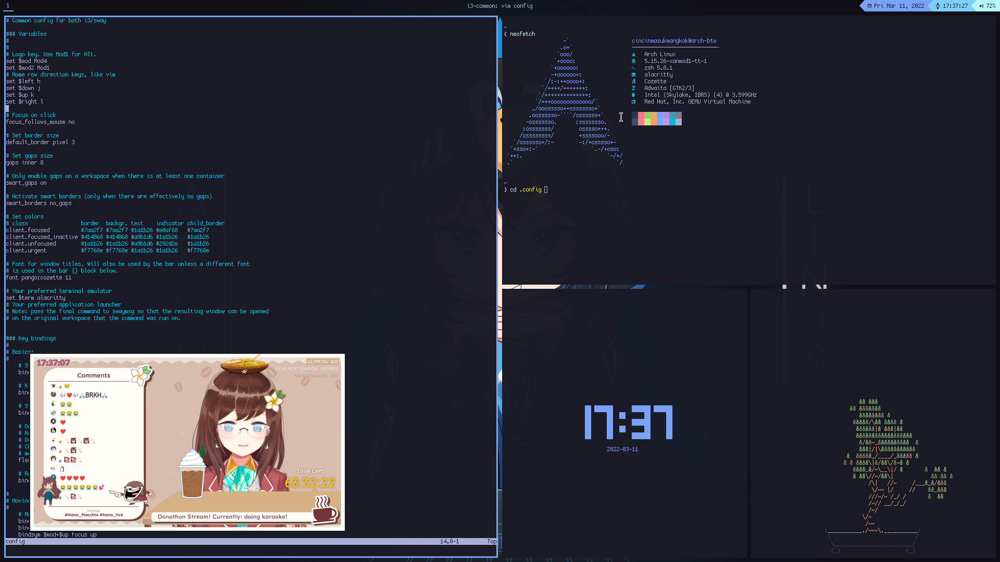
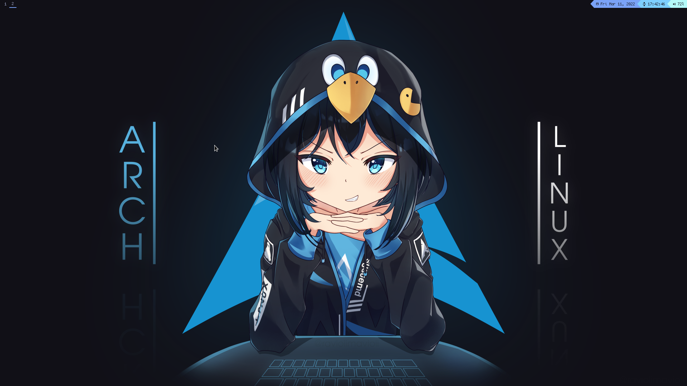

Arch-chan
========
An i3/sway rice based on [Tokyo Night](https://github.com/enkia/tokyo-night-vscode-theme) color scheme. 

Bar : [Waybar(sway)](https://github.com/Alexays/Waybar), [Polybar (i3)](https://polybar.github.io/) \
Terminal : [Alacritty](https://alacritty.org/) \
Wallpaper : [Arch Linux by Ravioli](https://www.pixiv.net/en/artworks/89596288)

Installation
------------

Copy everything to your home directory

Screenshots
---

  
  
  

