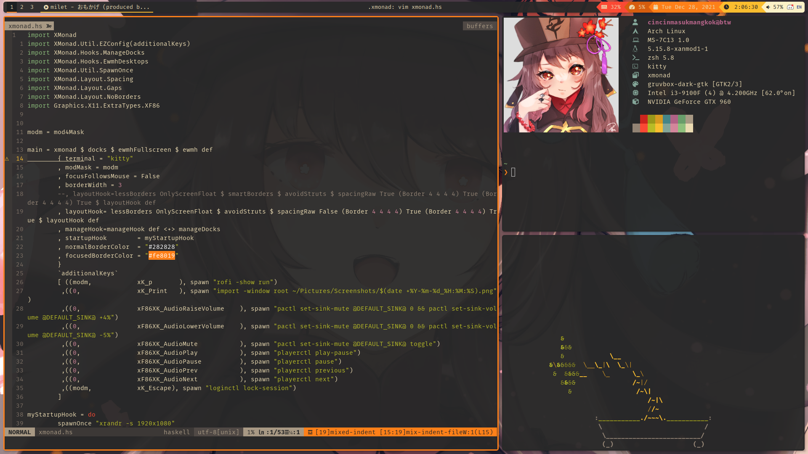

Gruv Tao
========
[gruvbox](https://github.com/morhetz/gruvbox) based rice.

vim color scheme: [gruvbox (community edition)](https://github.com/gruvbox-community/gruvbox) \
Bar : [polybar](https://polybar.github.io/) \
Terminal : [kitty](https://sw.kovidgoyal.net/kitty/) \
Wallpaper : [by あまのとう](https://www.pixiv.net/en/artworks/91124215) \
neofetch Image : [by 七海 杏](https://www.pixiv.net/en/artworks/95046677) 

Installation
------------
Requires xmonad 0.17 & xmonad-contrib 0.17

Copy everything to your home directory

Screenshots
---

