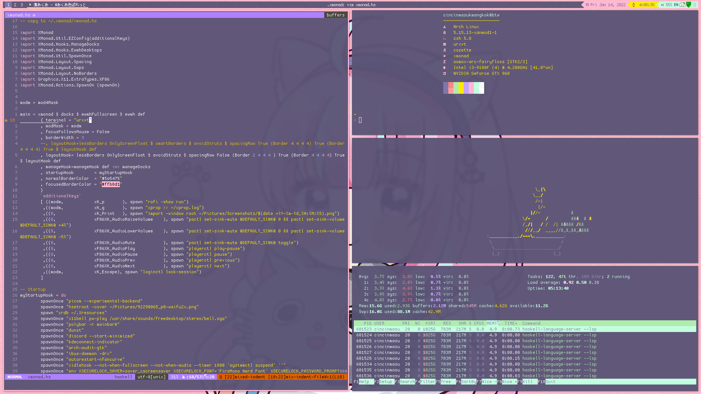

Minato Aqua rice
========
A rice based on [fairyfloss](https://sailorhg.github.io/fairyfloss/) color scheme. 

vim color scheme: [fairyfloss.vim](https://github.com/tssm/fairyfloss.vim) \
Bar : [polybar](https://polybar.github.io/) \
Terminal : [urxvt (truecolor & wide glyph patch)](http://software.schmorp.de/pkg/rxvt-unicode.html) \
Terminal color scheme : [fairyfloss (aquatier's version converted to .Xresources format)](https://github.com/aquartier/fairyfloss) \
Wallpaper : [あくあちゃんまとめ⚓︎ by にいな](https://www.pixiv.net/en/artworks/92290065) \
neofetch Image : [湊あくあさん by やまだこんた](https://www.pixiv.net/en/artworks/95249650) 

Installation
------------
Requires xmonad 0.17 & xmonad-contrib 0.17

Copy everything to your home directory

Screenshots
---

