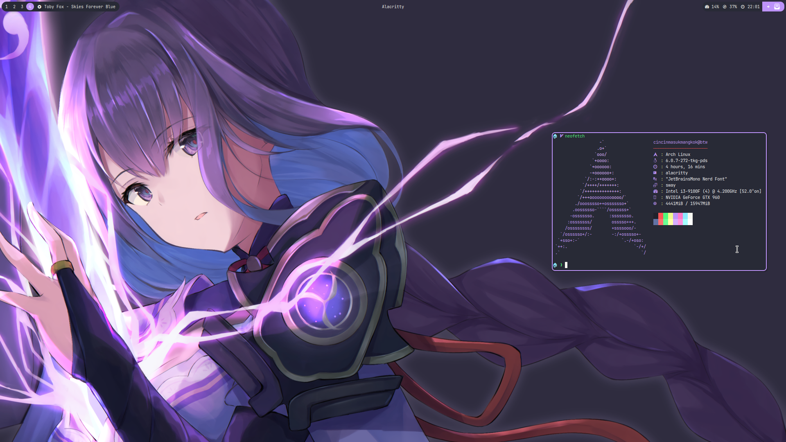
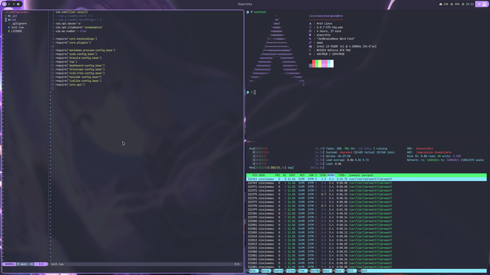

Raiden Shogun
========
A rice using [Dracula](https://draculatheme.com/) color scheme.

WM : [Hyprland](https://hyprland.org/) \
vim color scheme: [Dracula](https://github.com/dracula/vim) \
Bar : [Waybar](https://github.com/Alexays/Waybar) \
Terminal : [Alacritty](https://alacritty.org) \
Wallpaper : [雷電将軍 by くらいさん](https://www.pixiv.net/en/artworks/92175240) 

Installation
------------
Copy everything to your home directory

Note on keybindings
------
Hyprland config in this config uses xmonad-like keybindings instead of default hyprland keybindings

Screenshots
---

