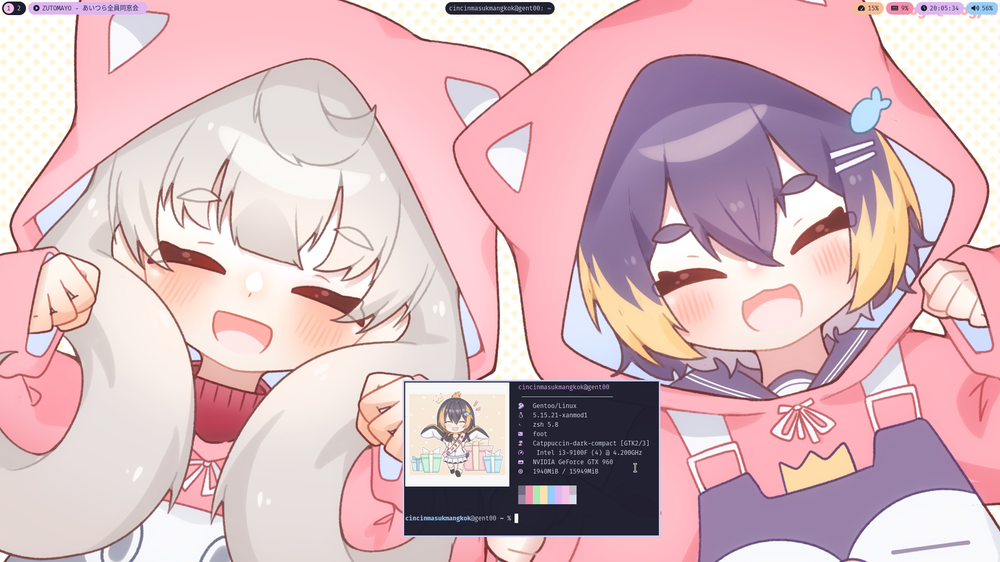
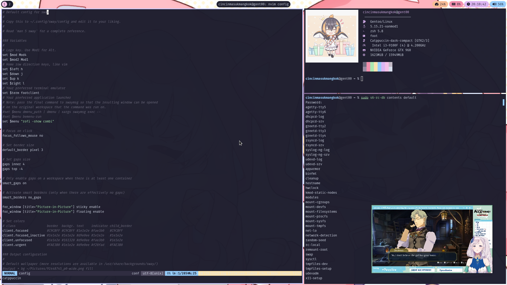
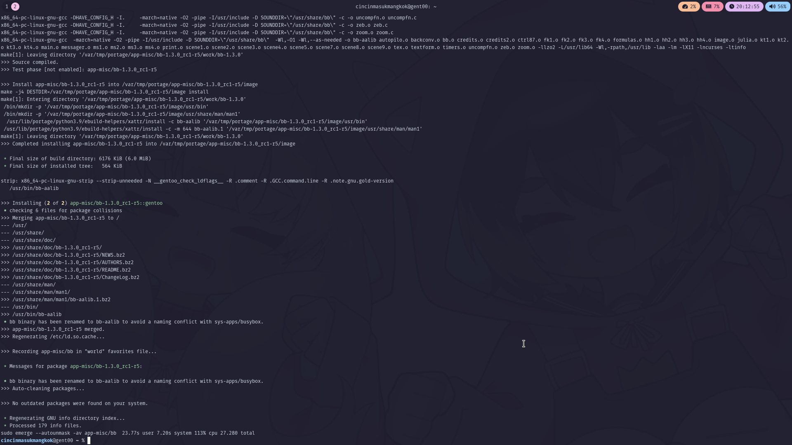

Swaydots
========
A sway rice based on [Catppuccin](https://github.com/catppuccin/catppuccin) color scheme. 

nvim color scheme: [catppuccin](https://github.com/catppuccin/nvim) \
Bar : [Waybar (`sway-window-newstyles` branch)](https://github.com/RobertMueller2/Waybar/tree/sway-window-newstyles) \
Terminal : [foot](https://codeberg.org/dnkl/foot) \
Wallpaper : [ねこのかめん by モギ](https://www.pixiv.net/en/artworks/95531701) \
neofetch Image : [Petra by 月梓](https://www.pixiv.net/en/artworks/94636745) 

Installation
------------

Copy everything to your home directory

Screenshots
---

  
  
  
  
  

